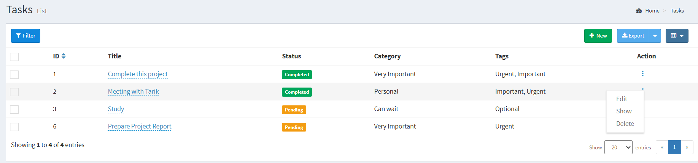
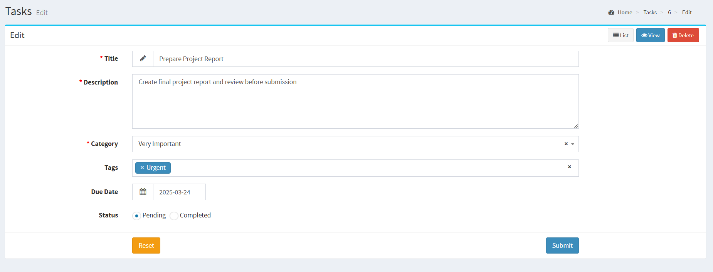
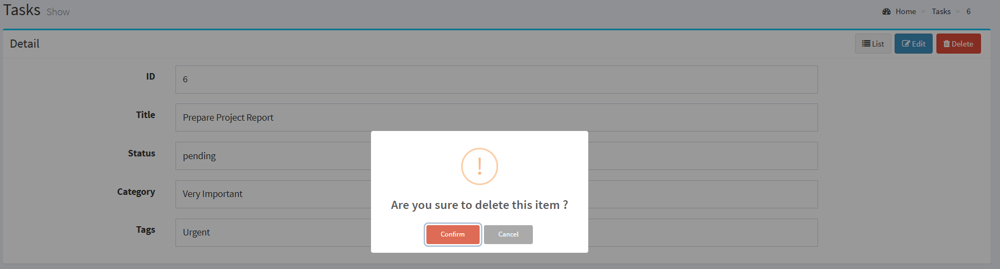
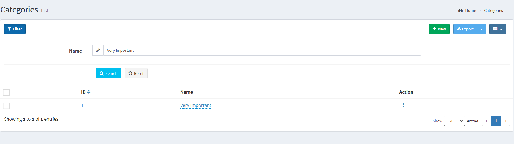
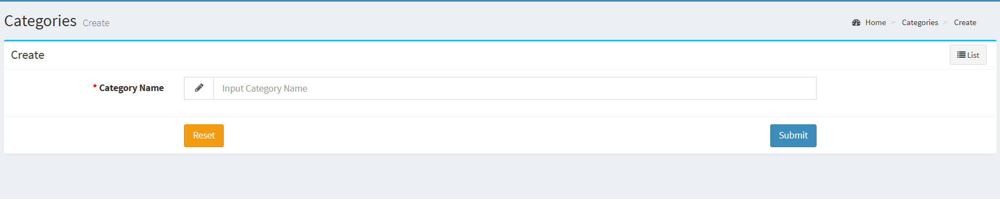
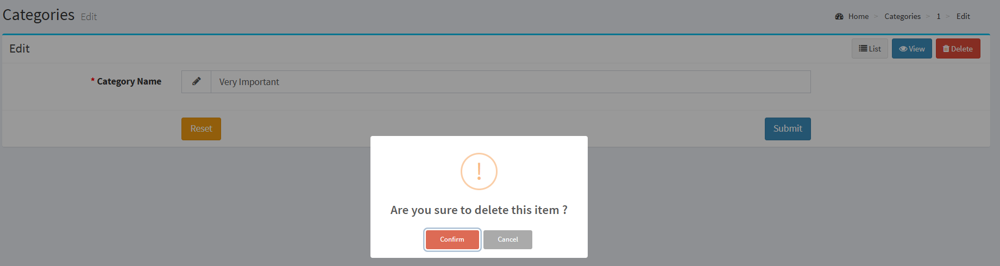
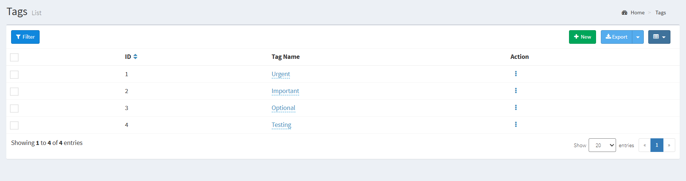
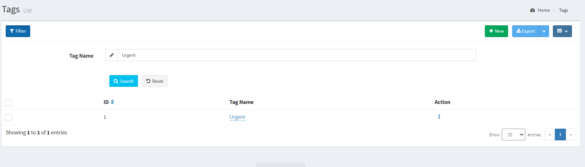
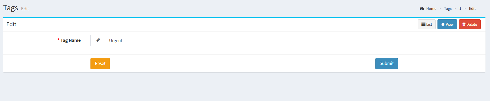

### Project Overview

This is a Task Management System built with Laravel and Laravel Admin. The application allows users to manage tasks, categories, and tags using an intuitive admin panel.

## Prerequisites

Before you install and run the project, ensure you have the following dependencies installed:

-   PHP >= 7.4
-   Composer
-   Node.js & npm
-   MySQL (or any other database used)
-   Laravel (installed via Composer)

## Installation & Setup

### Features

-   **Task Management:** Allows users to create, edit, delete, and assign tasks to specific categories and tags.
-   **Category Management:** Enables organization of tasks into different categories for better management.
-   **Tag Management:** Facilitates assigning multiple tags to tasks for enhanced filtering and searchability.
-   **Task Status Updates**: Mark tasks as pending or completed.
-   **Bulk Actions**: Mark multiple tasks as completed at once.
-   **Admin Dashboard**: View statistics on tasks, categories, and tags.

### Installation & Setup

1. **Clone the Repository**

    ```bash
    git clone https://github.com/GecaMelisa/task-manager.git
    cd task-manager

    ```

2. Install Dependencies

```bash
   composer install
   npm install
```

3. Configure Environment

    - **cp .env.example .env**
    - **DB_DATABASE=your_database**
    - **DB_USERNAME=your_username**
    - **DB_PASSWORD=your_password**

4. Run Migrations & Seed Database

-   **php artisan migrate --seed**

5. Start the Server
    ```bash
    php artisan serve
    ```
    - **The application will be available at http://127.0.0.1:8000**

## Admin Panel Access

-   **URL:** [http://127.0.0.1:8000/admin](http://127.0.0.1:8000/admin)
-   **Default Admin Credentials:**

    -   **Username:** `admin`
    -   **Password:** `password`

-   **To create a new admin user:**

```bash
    -   php artisan admin:create-user
```

-   **If you forget the admin password, reset it via:**
    ```bash
    php artisan tinker
    ```
    -   Then run: -
    ```bash
     use Encore\Admin\Auth\Database\Administrator; - Administrator::where('email', 'admin@example.com')->update(['password' => bcrypt('newpassword')]);
    ```

### Features & Usage Guide

#### Task Management

-   Navigate to **Admin Panel > Tasks**
-   Click **Create** to add a new task
-   Edit task details such as **title, description, due date, category, and tags**
-   Use the **bulk action** to mark tasks as completed

#### Category & Tag Management

-   Navigate to **Admin Panel > Categories or Tags**
-   Create, edit, or delete **categories/tags**
-   Assign **tasks to categories and tags**

#### Admin Dashboard

-   View **task, category, and tag statistics**
-   Quick access to **task management**

### Database Structure & Relationships

1. **Tasks Table (tasks)**
   | Column | Type | Constraints | Description |
   |-------------|--------|------------------------------------|----------------------------------|
   | id | INT | PRIMARY KEY, AUTO_INCREMENT | Unique Task ID |
   | title | STRING | NOT NULL | Task Title |
   | description | TEXT | NULLABLE | Task Description |
   | due_date | DATE | NOT NULL | Task Due Date |
   | status | ENUM | DEFAULT 'pending' | Task Status (Pending, Completed) |
   | category_id | INT | FOREIGN KEY (`categories.id`) | Associated Category |
   | created_at | TIMESTAMP | DEFAULT CURRENT_TIMESTAMP | Created Timestamp |
   | updated_at | TIMESTAMP | DEFAULT CURRENT_TIMESTAMP | Updated Timestamp |

2. **Categories table (categories)**
   | Column | Type | Constraints | Description |
   |--------|--------|---------------------------|---------------|
   | id | INT | PRIMARY KEY, AUTO_INCREMENT | Unique ID |
   | name | STRING | NOT NULL, UNIQUE | Category Name |
   | created_at | TIMESTAMP | DEFAULT CURRENT_TIMESTAMP | Created Timestamp |
   | updated_at | TIMESTAMP | DEFAULT CURRENT_TIMESTAMP | Updated Timestamp |

3. **Tags table (tags)**
   | Column | Type | Constraints | Description |
   |--------|--------|---------------------------|-------------|
   | id | INT | PRIMARY KEY, AUTO_INCREMENT | Unique ID |
   | name | STRING | NOT NULL, UNIQUE | Tag Name |
   | created_at | TIMESTAMP | DEFAULT CURRENT_TIMESTAMP | Created Timestamp |
   | updated_at | TIMESTAMP | DEFAULT CURRENT_TIMESTAMP | Updated Timestamp |

4. **Pivot table (task_tag)**
   | Column | Type | Constraints | Description |
   |----------|------|---------------------------------|------------------------|
   | task_id | INT | FOREIGN KEY (`tasks.id`) | Links to `tasks` table |
   | tag_id | INT | FOREIGN KEY (`tags.id`) | Links to `tags` table |

5. **Users Table (`users`)**
   | Column | Type | Constraints | Description |
   |------------|-----------|----------------------------------------|---------------------------|
   | id | INT | PRIMARY KEY, AUTO_INCREMENT | Unique User ID |
   | name | STRING | NOT NULL | User's Full Name |
   | email | STRING | NOT NULL, UNIQUE | User Email Address |
   | password | STRING | NOT NULL | Hashed Password |
   | created_at | TIMESTAMP | DEFAULT CURRENT_TIMESTAMP | Account Created Timestamp |
   | updated_at | TIMESTAMP | DEFAULT CURRENT_TIMESTAMP | Last Updated Timestamp |

### Screenshots

1. **Admin Login Page** - Users must log in with their credentials to access task management features
   

2. **Admin Dashboard** - Displays an overview of tasks, categories, and tags, providing quick access to task management.
   

3. **Task List Page** - Displays a list of all tasks with details such as title, status, category, and tags. Tasks are color-coded based on their status for better visibility.
   

4. **Task List Page - Overview & Actions** - Displays all tasks with filtering, bulk actions, and export options. Also, allows users to edit, view, or delete a task.
   
   

5. **Task Edit Page** - Users can modify task details such as title, description, category, tags, due date, and status. The page allows updating or deleting the task directly.
   

6. **Task Detail & Deletion Confirmation** - Users can view task details, including title, status, category, and tags. The page also allows editing and deleting a task, with a confirmation prompt before deletion to prevent accidental removals.
   
   

7. **Task Filtering & Search** - The task list page includes a filtering and search feature, allowing users to search for tasks by ID, title, and status. Users can apply filters, search for specific tasks, and reset filters when needed. The results are dynamically displayed in the task list below.
   

8. **Task Creation Page** - Users can add a new task by entering the title, description, category, tags, due date, and status. Required fields are marked with an asterisk (\*). The Reset button clears the form, while the Submit button saves the task. The List button on the top-right navigates back to the task list.
   

9. **Category List Page** - Displays all available task categories in a structured table format. Users can filter, export, and manage categories efficiently
   

10. **Categories - Filter & Search** - Users can filter categories by name using the search bar. The table displays matching results with ID, Name, and Actions. Options include adding, exporting, and changing the view mode.
    

11. **Create Category** - Users can add a new category by entering a name and clicking Submit. The Reset button clears the input.
    

12. **Edit & Delete Category** - The edit page allows users to modify an existing category name and submit changes. A delete option is available, which prompts a confirmation dialog before permanently removing the category.
    
    

13. **Tags List Page** - This page displays a list of all tags with their respective IDs and names. Users can create new tags, export data, and perform actions like editing or deleting existing tags.
    

14. **Tags List with Filter** - This screen displays a list of tags with filtering enabled by tag name. Users can search, reset filters, add new tags, export data, and perform actions on existing tags.
    

15. **Tag Management - Create & Edit** - Users can create a new tag by entering a name and clicking Submit, or edit an existing tag by updating the name and saving changes. The Reset button clears inputs, and navigation options include List, View, and Delete for managing tags efficiently.
    
    

### Code Quality & Documentation

-   **Follows MVC Architecture** – The project adheres to the Model-View-Controller (MVC) pattern, ensuring clean separation of concerns and maintainability.
-   **Well-Documented Functions** – Key functions include inline comments explaining their purpose and logic.
-   **Structured Migrations & Model Relationships** – Each model (Task, Category, Tag) has clearly defined relationships (one-to-many, many-to-many).
-   **Database Migrations** – Ensures database consistency and automatic schema generation.
-   **Best Practices Used:**
    -   Mass assignment protection using `$fillable` in models.
    -   Foreign key constraints in migrations for data integrity.
-   **Laravel Admin Panel** – Provides a user-friendly experience.

```

```
